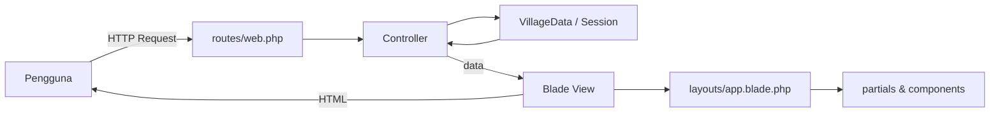

<div align="center">


<p>
  Konversi tampilan <strong>The Village</strong> (Sistem Informasi Acara Desa Pintar) dari React menjadi <strong>Blade Template</strong> pada framework Laravel.
</p>

<p>
  
  
  
  
</p>

<p>
  
  
  
  
</p>

<a href="https://github.com/MasRfif/TugasBesarTelkom_S2">
  
</a>
<a href="#cara-menjalankan">
  
</a>

</div>

---

## Tentang Repositori Ini

Repositori ini berisi **versi Laravel Blade** dari **The Village**, aplikasi sistem informasi acara desa yang memusatkan informasi kegiatan, pemesanan tiket, transaksi, dan verifikasi acara.

Versi aslinya dibangun dengan **React + Vite** pada sisi frontend dan **PHP Native MVC + MySQL** pada sisi backend (lihat [repositori versi React](https://github.com/MasRfif/TugasBesarTelkom_S2)). Pada repositori ini, seluruh tampilan (*view*) dikonversi menjadi **Blade View** sebagai pemenuhan **Tugas Akhir Pemrograman Web Semester 2**.

> [!NOTE]
> Proyek dikembangkan sebagai **Tugas Besar Mata Kuliah Pemrograman Web** oleh Kelompok 3, Program Studi Terapan Sistem Informasi Kota Cerdas, Fakultas Ilmu Terapan, Universitas Telkom.

> [!IMPORTANT]
> Versi ini fokus pada **penerapan Blade Template**. Data ditampilkan dari data contoh di `app/Data/VillageData.php` (bersumber dari `the_village.sql`) dan login memakai *session* demo, **tanpa database**. Integrasi MySQL penuh ada pada repositori versi React + PHP API.

---

## Daftar Isi

- [Ketentuan Tugas dan Pemenuhannya](#ketentuan-tugas-dan-pemenuhannya)
- [Fitur Halaman](#fitur-halaman)
- [Perbedaan dengan Versi React](#perbedaan-dengan-versi-react)
- [Teknologi](#teknologi)
- [Arsitektur Sistem](#arsitektur-sistem)
- [Struktur Folder](#struktur-folder)
- [Cara Menjalankan](#cara-menjalankan)
- [Akun Demo](#akun-demo)
- [Daftar Route](#daftar-route)
- [Tim Pengembang](#tim-pengembang)
- [Pemanfaatan AI](#pemanfaatan-ai)
- [Catatan Keamanan](#catatan-keamanan)

---

## Ketentuan Tugas dan Pemenuhannya

| Ketentuan | Penerapan | Lokasi |
|---|---|---|
| **a. Layout utama** | Satu layout memuat CSS, header/navbar, footer, dan `@yield('content')`. Seluruh halaman mewarisinya dengan `@extends`, `@section`, dan `@yield`. | `resources/views/layouts/app.blade.php` |
| **b. Directive percabangan & perulangan** | `@if`, `@elseif`, `@forelse`, `@foreach`, dan `@for` untuk menampilkan data event, kategori, FAQ, tiket, dan transaksi. | `pages/home`, `pages/events/index`, `pages/faq`, `pages/user/profile`, `pages/user/invoice`, dll. |
| **c. Komponen / partial** | Komponen Blade `<x-event-card>`, `<x-empty>`, `<x-status-badge>`, `<x-testimonial-section>` serta partial `@include` untuk navbar, footer, notifikasi, kartu tiket, dan statistik dashboard. | `resources/views/components/`, `resources/views/partials/` |
| **d. Route & named route** | Setiap halaman dapat diakses lewat route, dan seluruh tautan navigasi memakai `route('nama')`. | `routes/web.php` |

Directive kustom tambahan: `@rupiah($angka)` dan `@tanggal($tgl, 'format')` (didaftarkan di `AppServiceProvider`).

---

## Fitur Halaman

### Halaman Publik

- **Splash** dan **Pilih Peran** sebagai pintu masuk aplikasi.
- **Beranda**: hero pencarian, strip kategori, carousel acara mendatang, testimoni warga, dan ajakan menjadi penyelenggara.
- **Daftar Acara**: pencarian kata kunci, filter kategori, dan filter kota.
- **Detail Acara**: informasi lengkap, peta lokasi, pilihan tiket, jumlah, dan total harga yang dihitung langsung di halaman.
- **Peta Acara**: daftar titik lokasi event.
- **FAQ**: akordeon pertanyaan dan formulir pengiriman pertanyaan.

### Akun dan Pengguna

- **Login** dan **Registrasi** dengan validasi form serta pesan error dalam Bahasa Indonesia.
- **Profil**: tab *Tiket Saya* dan *Transaksi*.
- **Checkout** (pendaftaran peserta dan pilihan metode pembayaran).
- **Invoice** dengan instruksi pembayaran sesuai metode (QRIS, mobile banking, bayar di tempat, atau gratis) dan tombol cetak.

### Dashboard

- **Dashboard Admin**: statistik ringkas dan tabel verifikasi acara.
- **Dashboard Penyelenggara**: statistik ringkas dan tabel acara milik penyelenggara.

> [!NOTE]
> Kedua dashboard pada versi ini berupa tampilan ringkas. Fitur CRUD lengkap (kelola tim, pembayaran, laporan, dan sebagainya) tersedia pada versi React + PHP API.

---

## Perbedaan dengan Versi React

| Aspek | Versi React + PHP API | Versi Laravel Blade (repo ini) |
|---|---|---|
| Tampilan | Komponen React (JSX), SPA | Blade View, dirender di server |
| Routing | React Router (sisi klien) | `routes/web.php` dengan named route |
| Data | REST API + MySQL | Data contoh di `app/Data/VillageData.php` |
| Autentikasi | Token API | Session Laravel (demo) |
| Styling | CSS + Tailwind | CSS biasa (`public/css/app.css`) |
| Ikon | Lucide React | Lucide (CDN) |
| Interaksi | State React | JavaScript ringan (`public/js/app.js`) dan form HTML |

---

## Teknologi

<table>
  <tr>
    <th>Bagian</th>
    <th>Teknologi</th>
    <th>Kegunaan</th>
  </tr>
  <tr>
    <td>Framework</td>
    <td>Laravel 13</td>
    <td>Routing, controller, session, dan validasi</td>
  </tr>
  <tr>
    <td>Template</td>
    <td>Blade</td>
    <td>Layout, komponen, partial, dan directive</td>
  </tr>
  <tr>
    <td>Bahasa</td>
    <td>PHP 8.4</td>
    <td>Logika sisi server</td>
  </tr>
  <tr>
    <td>Dependency</td>
    <td>Composer</td>
    <td>Instalasi Laravel dan paket pendukung</td>
  </tr>
  <tr>
    <td>Styling</td>
    <td>CSS (`public/css/app.css`)</td>
    <td>Tema gelap-oranye The Village, responsif</td>
  </tr>
  <tr>
    <td>Icon</td>
    <td>Lucide</td>
    <td>Ikon antarmuka</td>
  </tr>
  <tr>
    <td>Server Lokal</td>
    <td>`php artisan serve`</td>
    <td>Menjalankan aplikasi tanpa XAMPP</td>
  </tr>
</table>

---

## Arsitektur Sistem



### Alur Kerja

1. Pengguna membuka URL atau menekan tautan (menggunakan `route('nama')`).
2. `routes/web.php` meneruskan request ke controller yang sesuai.
3. Controller mengambil data dari `VillageData` atau session, serta memvalidasi input form.
4. Controller mengirim data ke Blade View melalui `view('nama.view', $data)`.
5. View mewarisi `layouts.app`, mengisi `@section('content')`, dan memakai komponen/partial.
6. Laravel mengirim HTML hasil render ke browser.

---

## Struktur Folder

```text
the-village/
├── app/
│   ├── Data/
│   │   └── VillageData.php          # Data contoh (event, tiket, FAQ, dll.)
│   ├── Http/Controllers/
│   │   ├── PageController.php       # Splash, home, events, FAQ, peta
│   │   ├── AuthController.php       # Login, registrasi, logout
│   │   ├── UserController.php       # Profil, checkout, invoice
│   │   └── DashboardController.php  # Dashboard admin & penyelenggara
│   └── Providers/
│       └── AppServiceProvider.php   # Directive @rupiah dan @tanggal
│
├── public/
│   ├── assets/                      # Gambar event dan wallpaper
│   ├── css/app.css                  # Styling utama
│   └── js/app.js                    # Interaksi ringan (menu, FAQ, carousel)
│
├── resources/views/
│   ├── layouts/
│   │   └── app.blade.php            # Layout utama
│   ├── partials/                    # navbar, footer, flash, ticket-card
│   ├── components/                  # event-card, empty, status-badge, testimonial-section
│   └── pages/
│       ├── splash.blade.php
│       ├── role.blade.php
│       ├── home.blade.php
│       ├── faq.blade.php
│       ├── map.blade.php
│       ├── auth/                    # login, register
│       ├── events/                  # index, show
│       ├── user/                    # profile, checkout, invoice
│       └── dashboard/               # admin, organizer, _stats
│
├── routes/
│   └── web.php                      # Seluruh named route
├── .env.example
└── README.md
```

---

## Cara Menjalankan

### Persyaratan

- PHP 8.2 atau lebih baru (dikembangkan pada PHP 8.4).
- Composer.
- Git.
- Koneksi internet (untuk ikon Lucide dan font dari CDN).

> Tidak memerlukan XAMPP maupun MySQL.

<details>
<summary><strong>1. Clone repositori</strong></summary>

```bash
git clone https://github.com/MasRfif/NAMA-REPOSITORY-INI.git
cd NAMA-REPOSITORY-INI
```

</details>

<details>
<summary><strong>2. Instal dependensi</strong></summary>

```bash
composer install
```

</details>

<details>
<summary><strong>3. Siapkan file environment</strong></summary>

```bash
# Windows CMD
copy .env.example .env

# Git Bash / Linux / macOS
cp .env.example .env
```

Pastikan `.env` berisi:

```env
APP_NAME="The Village"
SESSION_DRIVER=file
```

`SESSION_DRIVER=file` diperlukan agar login demo dan transaksi (disimpan di session) berjalan tanpa tabel database.

</details>

<details>
<summary><strong>4. Buat application key</strong></summary>

```bash
php artisan key:generate
```

Tanpa langkah ini aplikasi akan menampilkan `MissingAppKeyException`.

</details>

<details>
<summary><strong>5. Jalankan aplikasi</strong></summary>

```bash
php artisan serve
```

Buka:

```text
http://127.0.0.1:8000
```

Untuk melihat seluruh route:

```bash
php artisan route:list
```

</details>

---

## Akun Demo

Password seluruh akun: `password`

| Role | Email | Tujuan setelah login |
|---|---|---|
| Administrator | `admin@village.test` | Dashboard Admin |
| Penyelenggara | `organizer@village.test` | Dashboard Penyelenggara |
| Masyarakat | `user@village.test` | Beranda |

> [!WARNING]
> Akun tersebut hanya untuk demonstrasi. Autentikasi pada versi ini berbasis session demo dan tidak untuk lingkungan produksi.

---

## Daftar Route

### Publik

| Method | URI | Nama Route | Keterangan |
|---|---|---|---|
| `GET` | `/` | `splash` | Halaman pembuka |
| `GET` | `/role` | `role` | Pilih peran pendaftaran |
| `GET` | `/home` | `home` | Beranda |
| `GET` | `/events` | `events.index` | Daftar acara (filter `?tag=`, `?city=`, `?q=`) |
| `GET` | `/events/{id}` | `events.show` | Detail acara |
| `GET` | `/faq` | `faq` | Bantuan dan FAQ |
| `POST` | `/faq` | `faq.submit` | Kirim pertanyaan |
| `GET` | `/map` | `map` | Peta acara |

### Autentikasi

| Method | URI | Nama Route | Keterangan |
|---|---|---|---|
| `GET` | `/login` | `login` | Form login |
| `POST` | `/login` | `login.submit` | Proses login |
| `GET` | `/register` | `register` | Form registrasi (`?role=PENYELENGGARA`) |
| `POST` | `/register` | `register.submit` | Proses registrasi |
| `POST` | `/logout` | `logout` | Keluar |

### Pengguna (wajib login)

| Method | URI | Nama Route | Keterangan |
|---|---|---|---|
| `GET` | `/profile` | `profile` | Tiket dan transaksi (`?tab=`) |
| `GET` | `/checkout/{ticketId}` | `checkout.show` | Form pendaftaran peserta |
| `POST` | `/checkout/{ticketId}` | `checkout.store` | Simpan pendaftaran |
| `GET` | `/invoice/{id}` | `invoice.show` | Invoice transaksi |

### Dashboard

| Method | URI | Nama Route | Keterangan |
|---|---|---|---|
| `GET` | `/admin` | `admin.dashboard` | Dashboard administrator |
| `GET` | `/organizer` | `organizer.dashboard` | Dashboard penyelenggara |

---

## Tim Pengembang

<table>
  <tr>
    <th>Nama</th>
    <th>NIM</th>
    <th>Kontribusi Utama</th>
  </tr>
  <tr>
    <td><strong>Cintia Desti Wahyuni</strong></td>
    <td>707012500080</td>
    <td>Autentikasi, login, registrasi, session, dan pengujian akses pengguna</td>
  </tr>
  <tr>
    <td><strong>Moehamad Farellino Rizqika M.</strong></td>
    <td>707012500030</td>
    <td>Halaman beranda, daftar event, detail event, dan pengelolaan event organizer</td>
  </tr>
  <tr>
    <td><strong>Naufal Rafif Nurqodri</strong></td>
    <td>707012530004</td>
    <td>Lead developer, database, ticketing, transaksi, dashboard admin, integrasi API, debugging, deployment, dan konversi ke Laravel Blade</td>
  </tr>
</table>

<div align="center">

**Kelompok 3 — D4 Sistem Informasi Kota Cerdas**  
**Fakultas Ilmu Terapan — Universitas Telkom**

</div>

---

## Pemanfaatan AI

AI digunakan sebagai alat bantu dalam proses pengembangan dan dokumentasi:

- **Claude** membantu brainstorming ide, debugging kode, dan konversi tampilan React ke Blade Template.
- **ChatGPT** membantu penyusunan laporan serta penyempurnaan CSS.
- **Google Gemini** membantu pencarian resource dan referensi data.
- **Stitch by Google** membantu eksplorasi palet warna dan ide desain.

Seluruh hasil tetap diperiksa, disesuaikan, dan diuji kembali oleh anggota kelompok.

---

## Catatan Keamanan

- File `.env` **tidak** disertakan di repositori. Gunakan `.env.example` lalu jalankan `php artisan key:generate`.
- Login pada versi ini hanya demo (session, tanpa database) dan tidak untuk produksi.
- Seluruh form memakai `@csrf` untuk perlindungan CSRF.
- Keluaran data memakai `{{ }}` sehingga otomatis di-escape terhadap XSS.

---

<div align="center">


<strong>The Village</strong><br/>
Menghubungkan masyarakat, penyelenggara, dan kegiatan desa melalui teknologi.

</div>
